# wur_life_lore

> 本文从一个WUR硕士项目新生的视角分享瓦村生活知识，因此主要适用于WUR硕士新生参考。

标有:ok:的章节意味写作完毕。

## 一种可能的丝滑入学时间线

|        | 时间 | 注意事项 |
| ------ | ---- | -------- |
| 办签证 |      |          |
| 租房   |      |          |
| 办BSN  |      |          |
| 开DigiD  |      |          |
| 拿WUR学生卡  |      |          |

## 新生租房:ok:

### 新生租房简介

瓦村学生房源主要由与学校合作的[Idealis](https://www.idealis.nl/en/)提供，并通过[room.nl](https://www.room.nl/)平台进行选房。由于room.nl在分房时按照账号注册时间先后和priority排序，所以新生需要尽早在room上注册。7月左右新生会收到idealis发来的priority邮件，7.15 priority生效后选到房的概率较大。总体来讲瓦村租房压力不大，4月注册room.nl也能有一定的房间选择空间，如果和我一样前一年10月开始申请时就注册了，那么有优先权的房子基本随便选。

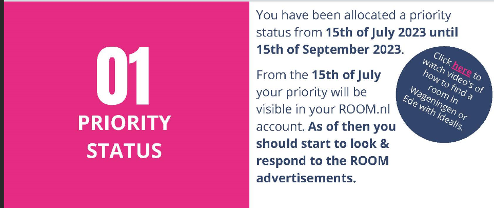

### 选房

因为优先权仅分配给部分房源，瓦村硕士新生基本上只能排到Nieuwe Kanaal（NK），Bornsesteeg（B楼），Dijkgraaf （D楼），Hoevenstein（H楼），Asserpark（A楼），Marijkeweg（M楼），Haarweg（哈外）的房间，我个人的建议是优先选NK，理由如下。

1. Self-Contain房型
   1. 独立卫浴，厨房，隐私性好
   2. 不用开室友盲盒

2. 房间均为18平，大小不错。

3. 房补之后月租在320欧左右，和share房型其实差不多，有时甚至更加便宜。（有的人可能会贵100欧，取决于此前的能源费用，但能源费用后续会多退少补）

4. furnitured，自带一张床，一套桌椅，一个衣柜，一个冰箱。

5. 有空调，而其他楼没有。

6. 浴室有空气控制系统，可以根据湿度和二氧化碳浓度动态排气。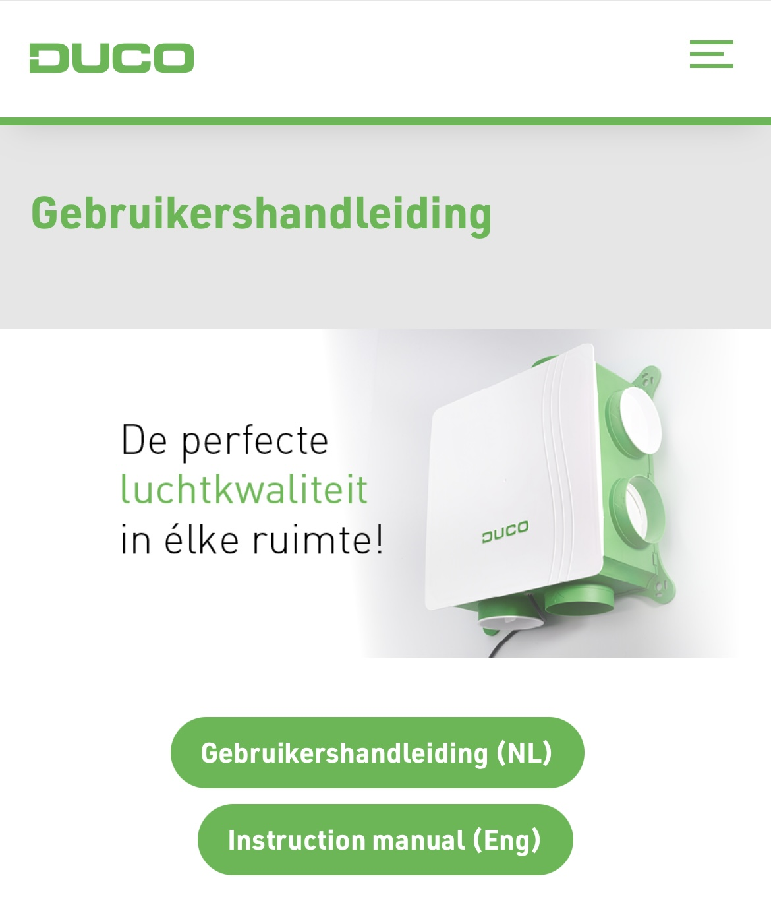

7. 有智能电表，可以查看每天各时段功率，每天和每月耗电量。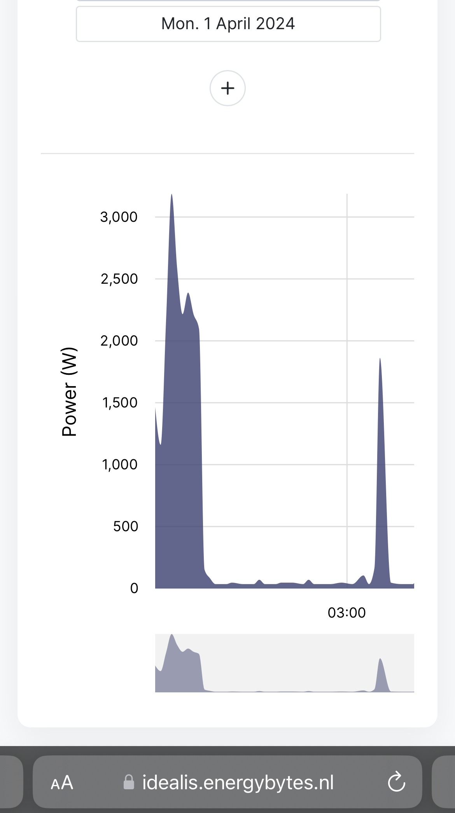

8. 墙壁和窗户隔音效果极好，只有门隔音较差。

9. 楼层低，不会被A、B、H、D楼的垃圾老电梯折磨。

10. 门口就是公交站，公交非常方便。

11. 骑车去市中心和学校均在8min左右（我个人速度）。

12. 中国人很多，中餐聚会方便。

13. 建筑中没有石棉这种致癌物，荷兰在1993年之后才禁止石棉的使用，而瓦村老公寓都在此之前建成。“所有形式的石棉**对人体均有致癌性**。 接触石棉，包括温石棉，会导致肺癌、喉癌和卵巢癌，还会导致间皮瘤”——[WHO](https://www.who.int/zh/news-room/fact-sheets/detail/asbestos-elimination-of-asbestos-related-diseases#:~:text=所有形式的石棉对,工作场所接触到石棉。)。前段时间M楼的朋友收到了M楼检测石棉的邮件，说明瓦村的老公寓有一定石棉风险.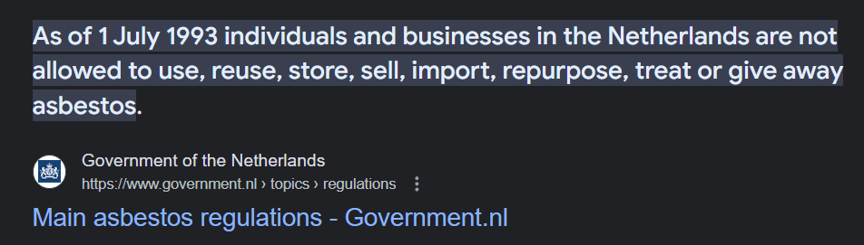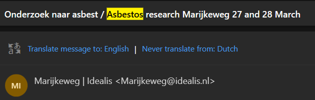

    

总而言之**选新不选旧**，**选self不选share**。新房设施先进，东西不容易坏；self保障隐私。

### NK房间选择

NK是一个临时集装箱房，但如前文所述设施非常先进，并且有长满青草地的内庭，南北各有一条河，环境优美。

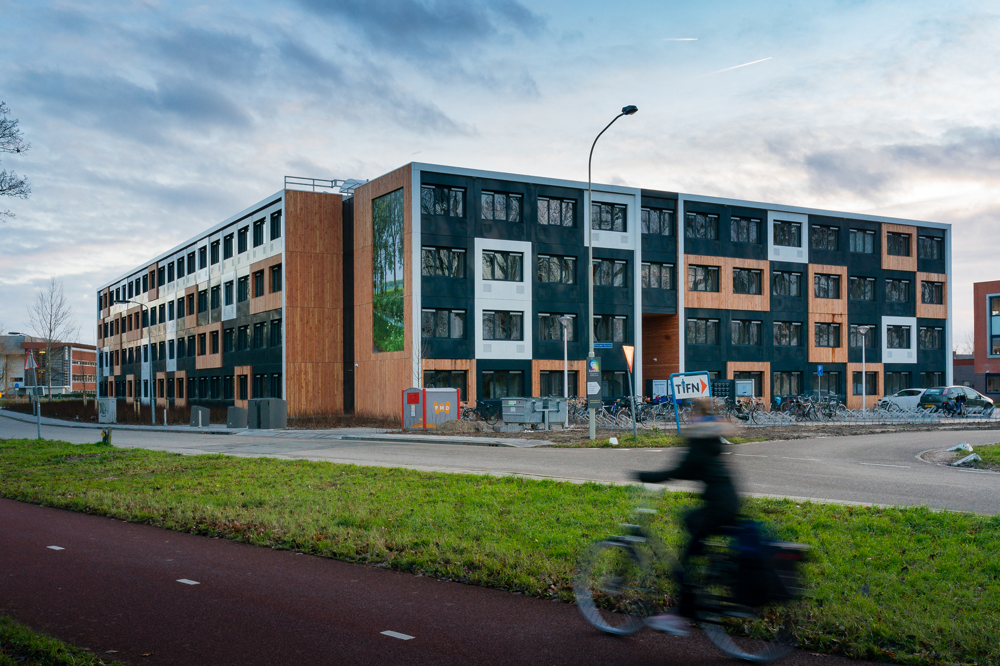

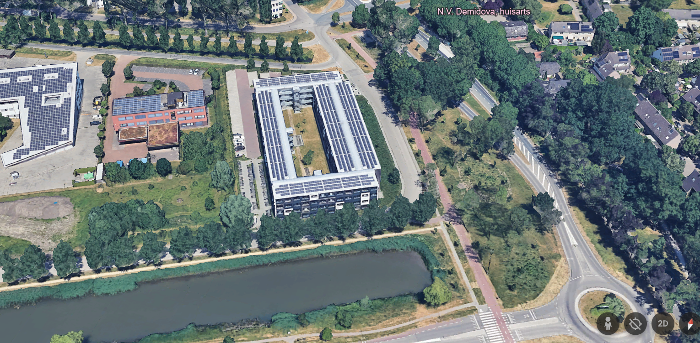

NK的详细建筑介绍可以看[这里planviewer.nl](https://www.planviewer.nl/imro/files/NL.IMRO.0289.10Nieuwekanaal1-PJB2/t_NL.IMRO.0289.10Nieuwekanaal1-PJB2.pdf)，这里简要介绍**我**对NK的选房推荐。NK各楼层房号分布基本一致，这里以floor1为例。注意，floor1相当于国内二楼，因为荷兰的楼层从0而非1开始。使用排除法得出最佳房型：

1. （必须）排除**common room和洗衣房附近房间**，即图中正下方红圈的房间。commom room主要用来开party，party人半夜玩high了非常吵。
2. （必须）排除**门面向内庭的房间**，很多人party人半夜在内庭high，而门是NK隔音最差的部分。
3. （必须）排除**0楼所有房间**，隐私性非常差，不把窗帘拉上的话房间在路人眼里一览无余，而且太低看不到风景。
4. （必须）排除**东侧窗户靠内的房间**，即图中正上方红圈的房间，隐私性差，没有风景。
5. （可选）排除不被其他房间包住的房间，比如建筑四角的房间，保暖性差。
6. （可选）排除顶楼3楼的房间，保暖性差。
7. （可选）排除西面房间，西晒非常折磨。
8. （可选）排除南面房间，荷兰纬度高，南面太阳直射眼睛。
9. （可选）排除东面房间，窗户面朝交通主干道。

经过以上排除后，我最推荐的房间是**1楼和2楼北面，门不直对内庭的，且不在建筑四角的房间**，即**绿圈**内的房间。

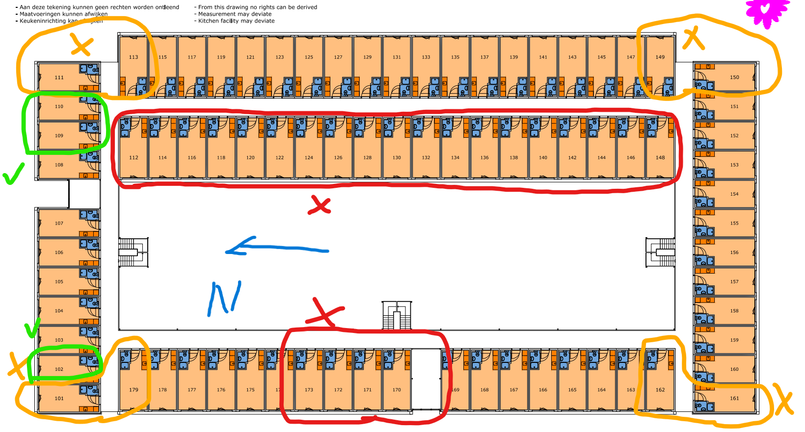

### 技术细节

Idealis的房间在签合同时需要用手机接受验证码，但国内手机卡收不到验证码，这时可以找在荷兰的朋友用荷兰手机号帮忙收验证码。

Idealis的工作时间非常短，这非常不利于新生取钥匙。第一种解决方案时写邮件给idealis或者对应楼的housing manager，让他们把钥匙放在B楼0层的钥匙箱里，到达瓦村后用钥匙箱对应密码取出钥匙即可，第二种方案是托朋友取，这种情况需要联系idealis，并说明身份验证方式。

## 税务和补贴

### 房补申请:ok:

住idealis studio的新生都可以申请房补，申请流程参见我的知乎回答，[荷兰房补申请流程 - 知乎 (zhihu.com)](https://zhuanlan.zhihu.com/p/655821518)。

### 健康补贴

健康补贴只在

### 水税

## 衣着:ok:

每个人的抗寒耐热能力不同，这里把我这个湖南人在瓦村的穿搭习惯列出以供参考：

| 月份    | 室内             | 室外                    | 备注                                                         |
| ------- | ---------------- | ----------------------- | ------------------------------------------------------------ |
| 11-3    | 短袖t恤+长袖衬衫 | 短袖t恤+长袖衬衫+羽绒   | 由于能源危机，环保等因素的影响，WUR教学楼室内大概20度左右，穿短袖会比较冷。 |
| 4-5, 10 | 短袖t恤+长袖衬衫 | 短袖t恤+长袖衬衫+冲锋衣 | 这里的穿着均为平均值，不代表少数极端气温                     |
| 6-9     | 短袖t恤          | 短袖t恤                 |                                                              |

关于荷兰天气的详细评价，参考我的知乎回答， [荷兰天气真的很差吗？ - 知乎 (zhihu.com)](https://zhuanlan.zhihu.com/p/688753296)。

## 自行车:ok:

因为公交车昂贵，覆盖范围小，频次低，自行车是瓦村学生最主要的日常交通工具。

### 买车

我建议去正规车店买高质量的二手车。

首先，为什么二手？由于荷兰产业转移，增值税较高等原因，荷兰新自行车的价格远远高于国内，不错的新车往往要五六百欧才能拿下，而用过三五年内的二手车能在体验极为接近新车的情况下，价格是新车的70%，50%甚至更低。比如笔者目前使用的Gazelle Esprit，新车售价729欧，而我购买车龄不到3年（车架上可见生产年份）仅需450欧，是原价的61%，使用近一年除了1月最冷的几天出现过无法换档的情况外无任何爆胎，掉链子等折磨人的情况。

第二，为什么买高质量？

自行车作为每天都要陪伴我们的伙伴，如果很难骑或者经常损坏会十分令人糟心，所以我非常不建议为了省个一两百欧买伊拉克战损的n手车。破烂n手车虽然几十欧就能拿下，但是后续维修、换车所需的时间和金钱成本完全足够让你在一开始买一辆好车。那么如何判断车的质量呢？从价格上来看，正规车店200欧以上的车都还不错。对车本体而言，链条光滑，漆面无大面积脱落，换挡顺滑，车轴和车体连接不松垮的车质量不会太差。

第三，为什么去正规车店买？

正规车店卖的车根据荷兰消费者保护相关法律，参见：[Consumer Rights in The Netherlands - Amsterdam Mamas (amsterdam-mamas.nl)](https://amsterdam-mamas.nl/articles/consumer-rights-in-the-netherlands/)， 应当提供6个月的质保。一些车店也会提供更长时间的质保，比如我买车的这家店[Van de Wetering tweewielers (vandeweteringfietsen.nl)](https://vandeweteringfietsen.nl/)就对二手车提供12个月质保。

关于车本身的特性，我个人比较看重以下几点：

1. 有链条护罩
2. 至少三档
3. 手刹（脚刹骑不好就容易打滑摔倒）
4. 出厂前后车灯

### 修车

如果你的车是从车店买的并且质保没过期的话，直接让车店修就好啦，否则可以取瓦村学生们组织的免费修车，或者其他修车/单车店。

1. 瓦村学生每周免费修车[WUR_student_bike_repair](https://www.instagram.com/wur_student_bike_repair/)。
2. Jumbo对面的修车老爷爷。
3. 各种单车店。PS：离学校最近的是[这家店](https://maps.app.goo.gl/JG2jzLoVBN2GvGka7)，但我听说过一些不好的体验。

另外，部分idealis学生公寓有修车高手，我的一个荷兰朋友非常热爱修车，可惜他已经从NK搬到了Costerweg。

### 配件
锁
一般来讲，自行车会自带一个这样的环形锁，把轮胎和车身锁住。在瓦村这样相对安全的地方，这个环形锁基本够用。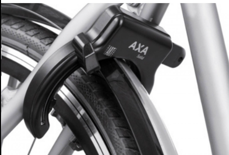
但如果你是风险厌恶型选手，建议再来一个链锁，把车身和停车架等不可移动的东西锁在一起。
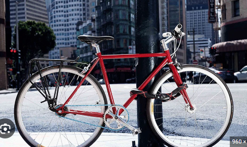

车灯
荷兰法律规定晚上骑车必须打开前后车灯，前灯白色或黄色，尾灯红色，不开灯被抓会罚款大几十欧。

车包
车包是在瓦村买菜遛弯的必备配件，因为自己的背包往往容量不足，而且背着一大堆东西骑车很不舒服。车包选择防水大容量的即可，我个人在瓦村市中心的[Blokker](https://maps.app.goo.gl/Q8q9D3u3e716UcDw6)买的这一款[车包](https://www.blokker.nl/dubbele-fietstas-40l-recycled/3529028.html)，价格比较高但是防水耐造，容量很大，可以一次性装下两人份一周的菜。

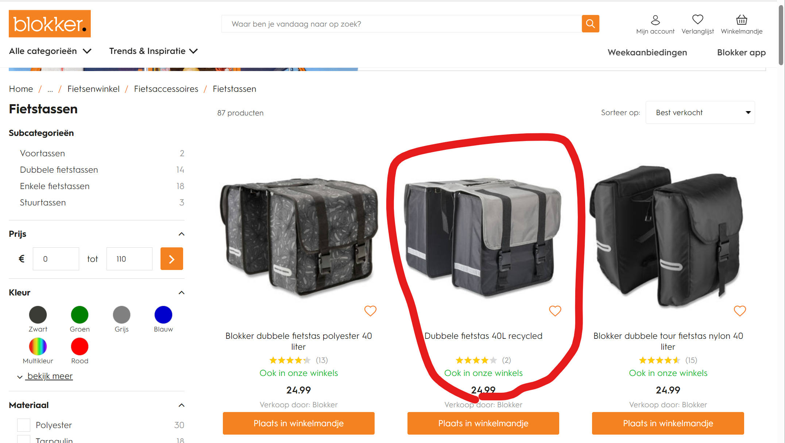

### 骑车规则

荷兰交通规则与国内大体类似，主路先行，让右，礼让行人。这里列出几个和国内比较明显地不同。

1. 左右转弯前伸出对应手臂指明转弯方向。
2. 地上的鲨鱼牙代表你必须让行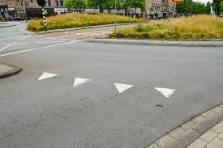。
3. 夜晚骑行必须开前后灯。

较为详细规则和路牌速览见：[holland2stay.com/blog/dutch-cycling-rules.html](https://holland2stay.com/blog/dutch-cycling-rules.html)

瓦村相关骑行见： [Welcome - Cycling In Wageningen](https://www.cyclinginwageningen.nl/)， 内含瓦村修车点，租车点，停车设施，推荐的观光骑行路线等

官方全面解释见: [Road Traffic Signs and Regulations in the Netherlands | Report | Government.nl](https://www.government.nl/documents/reports/2024/02/09/road-traffic-signs-and-regulations-in-the-netherlands)

特别需要注意的是，实际情况中你会发现很多荷兰人骑车违反交通规则，很多人认为确保安全的情况下没必要循规蹈矩。这种行为留学生是否要效仿？我认为确保人身安全和钱包安全即可。

## 公交、包车:ok:

### 包车

从机场到瓦村23年时的价格是50欧左右每人。我2023年8月落地时约的是村里的[伊朗大叔](https://dilmanlogistics.nl/) Dilman，可以加微信沟通，提前约好在机场停车场见面的时间即可。Dilman人非常热情，在接送的路上会和新生唠嗑，给新生科普瓦村知识，同时也会给新生发Lebara的电话卡，帮新生免去了落地自己找电话卡的步骤。

### 公交

荷兰公交在欧洲范围内算是非常顶级的存在了，公交、火车频率一般在每30、60分钟一趟，准点情况也远好于隔壁德国[DB](https://int.bahn.de/en)。可以直接通过Google Map，Apple Maps查看车辆班次，但荷兰人都更喜欢[9292.nl](https://9292.nl/)。公交的实时位置可以通过[ovzoeker.nl](https://www.ovzoeker.nl/)查看。

荷兰全国通用的乘车方式是刷卡乘车，上下车都要刷，逃票被抓到会罚款几十欧，只上车刷而不下车刷会按最大可能行程扣款或者罚款。Mastervard或者Visa卡（ApplePay上的卡也行）可以直接刷，然后通过[OVpay](https://www.ovpay.nl/en)查看记录，也可以刷[OV卡](https://www.ov-chipkaart.nl/)。我个人比较推荐用OVpay，因为用了ApplePay以后可以只带手机出行，并且OVpay的app会实时显示check-in和check-out的消息，避免了OV卡不知道是否刷卡成功的问题。另外，ApplePay+OVpay也远比OV卡灵敏，刷卡时基本在1s内成功，而OV卡很多时候会出现好几秒甚至更长时间才能刷上的情况。

### OV卡办理

OV卡办理有两种方式，第一种是去官方购买[OV-Chipkaart.nl - OV-Chipkaart.nl](https://www.ov-chipkaart.nl/)，有匿名和实名两种，实名只能本人使用，但是可以用来办理各种交通运营商的服务套餐。OV卡官网办实名卡收取7.5欧制卡费，所以我更推荐第二种方法。第二种是去[NS](https://www.ns.nl/abonnementen/)（荷兰铁路）申请NS Flex的优惠，申请时选择开一张新卡，这样在5个工作日内你就会得到一张带有NS Flex优惠套餐和NS Logo的实名OV卡，无需制卡费。

### NS铁路优惠

[NS](https://www.ns.nl/abonnementen/)运营着荷兰绝大多数的铁路，主要城市均可以通过NS的路线到达，但NS的乘车费用高昂，没有优惠的情况下，从Ede-Wageningen到Amsterdam Centraal需要16.9欧，也就是说周末往返阿姆一趟的火车费就要30多欧。所以大多数瓦村学生会开一张周免卡，周末免费乘坐NS的路线。周免卡的荷兰语叫[Weekend Vrij](https://www.ns.nl/abonnementen/weekend-vrij?gad_source=1&gclid=CjwKCAjwnei0BhB-EiwAA2xuBscghiyakBE_Z7xdIan4z8oRDLQvB88hl6CsgWzNinJG68ZjrdwLhBoCUzkQAvD_BwE)，每个月费用34.95欧，并且可以加9欧升级为周末免费一等座，个人非常推荐加这9欧，因为二等座经常会找不到座位。不想自己开周免卡的同学可以在各种群里收周免卡，但做好被查到非本人使用的心理准备，即使概率很小。

除了周免卡外，NS的其他各种优惠也可以在[NS官网](https://www.ns.nl/abonnementen/)办理。

## 免费上厕所

万恶的欧洲资本主义

[HogeNood - Find and Rate Toilets](https://en.hogenood.nl/)

## 购物:ok:

### 超市

> 各大连锁超市基本都有会员卡，一定要注册，能省下很多钱。一般来讲线上注册然后手机app里调用。

[Jumbo](https://maps.app.goo.gl/jKDPLte92FNiLvdT7)，最常见的荷兰连锁超市之一，离B楼、D楼、H楼非常近

[Groentehal De Goudreinet](https://maps.app.goo.gl/TZhWMbJCf1dsXCBN6), Jumbo对面的蔬菜店

[新中国](https://maps.app.goo.gl/Ki8G47kgc9xQYwPG6Jumbo), Jumbo对面的中国超市，非常方便但是价格很高

[AH](https://maps.app.goo.gl/dbKep3Hy6yKBu1wM8)，荷兰最大的连锁超市，离Javastraat和Churchillweg非常近，是我最喜欢的超市，品质高，app体验好，价格在有折扣的情况下并不贵，强烈建议开他家的12欧一年的Premium会员，可以获得很多额外的折扣，基本一个月就回本了。与AH联动的[Air Miles](https://www.airmiles.nl/)也一定要打开，购物积分后可以换各种优惠券或者购物抵现金。AH的[Koopzegels]([Koopzegels nu digitaal sparen | Albert Heijn (ah.nl)](https://www.ah.nl/acties/koopzegels?gad_source=1&gclid=CjwKCAjw4_K0BhBsEiwAfVVZ_-DryLxTLEsivbfaal-klaGLmKdrYZbSQI9spxPMCzcRS8j3F-X7xBoCxqMQAvD_BwE))对于以AH为主力超市的同学来说也是不错的理财产品，每次购物赞Koopzegel，攒满49欧后可以换52欧现金，或者在购物时抵扣52欧。

[Foladi Groenten & Fruit](https://maps.app.goo.gl/hjJgJfzCDMjLJ7Ls6), AH对面的蔬菜店，品质很好但是价格较高。

[Lidl](https://maps.app.goo.gl/iTVgsaSjHjs5TBCS9), 德国来的廉价超市，离Javastraat和Churchillweg非常近，价格比较便宜。

[Hoogvliet](https://maps.app.goo.gl/gmNbNa2Qc6fGscRA8)，离M楼和Costerweg非常近，价格比较便宜。

[AH togo](https://maps.app.goo.gl/Sw9GFYQTVr2uqCEXA)，严格意义上不是超市，是AH旗下的便利店，能买到面包、三明治等速食，价格非常贵。

[AH XL](https://maps.app.goo.gl/rypG8nfMnmjNL4eX9)，AH的超大版，在隔壁城市ede，是瓦村及附近东西最全的超市，从Forum骑车过去大概20-30min。

[Spar](https://maps.app.goo.gl/Kg2jVViuYQP35vwj8)，在NK北面的居民区中，价格非常贵。

对于看重价格的同学，可以使用超市比价网站[Supermarktscanner](https://www.supermarktscanner.nl/)，搜索物品名称，选择超市即可快速查看价格。

| 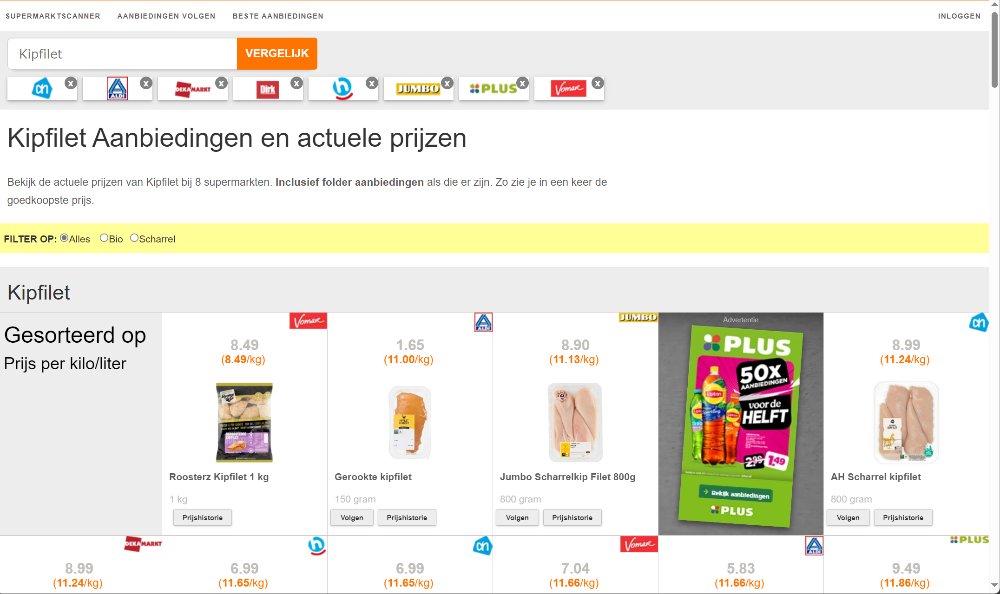 |
| :---------------------------------------------: |
|          Supermarketscanner Interface           |

| 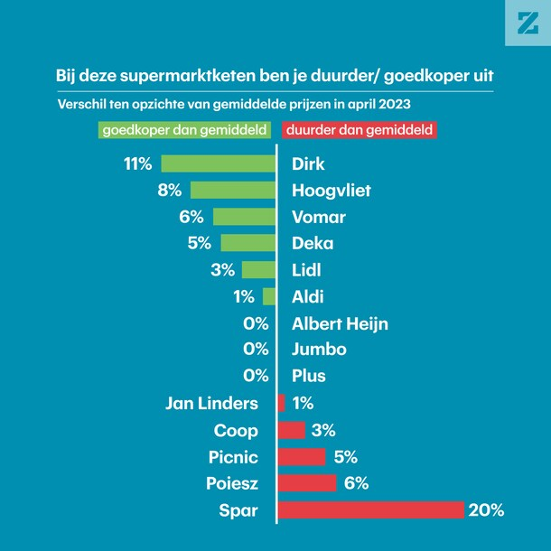 |
| :----------------------------------------------------------: |
| 荷兰各超市价格与价格中位数的对比，来自[rtl.nl](https://www.rtl.nl/rtl-nieuws/rtl-z/artikel/5387396/consumentenbond-spar-duurste-supermarkt-dirk-goedkoopste) |

### 集市

瓦村每周三8：30-13：00，每周六8：30-17：00有集市，可以买到新鲜的海产、肉和蔬菜，以及各种杂物。

参见，[Koopzondagen en markt - Gemeente Wageningen](https://www.wageningen.nl/direct-regelen/bouwen-wonen-groen/wonen/koopzondagen-en-markt/#:~:text=Elke woensdag van 8.30 tot,Markt%2C Raadhuisplein en de Vijzelstraat.)

### 做饭

如果你想学习做饭，我推荐以下学习资源

1. [老饭骨](https://space.bilibili.com/419872064/video)，国宴大师。
2. [主厨广坦](https://space.bilibili.com/507091844/video)，法国大厨，也做中餐。
3. [奥地利的小胡](https://space.bilibili.com/386165680?spm_id_from=333.337.0.0)，西餐大厨。
4. [美食强](https://space.bilibili.com/240869947?spm_id_from=333.337.0.0)，中式家常菜。
5. [老高](https://space.bilibili.com/3546672569256789/video)，美食家，品鉴美食，讲美食文化，以及烹饪技法。

不建议向那些靠美图吸引流量的博主学做饭，他们的理论知识和实战经验都远不如上述频道中的厨师。

### 馆子

1. [Onder de Linden](https://maps.app.goo.gl/pTGT6pp5mpj39FH66), 可能是瓦村最好的Cafe，烤鸡和排骨很好吃。
2. [Sole d'Italia](https://maps.app.goo.gl/qwJFWpn3rNmvxLC39), 我被很多意大利同学推荐过的意大利餐厅，注意晚上5点后才开门，而且生意好但座位不多，周末去建议提前订座。
3. [Soek Damascus](https://maps.app.goo.gl/87dTSjVRu8deRax9A), 叙利亚菜。
4. [东方快餐校园店](https://maps.app.goo.gl/SvJbuXidjJZaj76e6), 在Campus Plaza 0楼，中式快餐。
5. [Unilever](https://maps.app.goo.gl/i7CxyJ74Y852yMvP8)，Unilever的食堂，中午对外人开放，食材质量高。
6. [Yummie-Africana](https://maps.app.goo.gl/Wooei2Z9N2KzTL418), 市中心的非洲菜。
7. [Antalya 07](https://maps.app.goo.gl/vYMLgXXyDw48J6qt7)，土耳其快餐店，卖最经典的Kebab和Kapsalon等快餐。
8. [Ijssalon Antonio](https://maps.app.goo.gl/zfn1eqc4J4HNNbpMA), 市中心的冰淇淋店。
9. [Stadsbrouwerij Wageningen](https://maps.app.goo.gl/137mCfSghP17TK3h7), 市酿酒厂，Wageningen Blond最为经典。
10. [Caffè Tola](https://maps.app.goo.gl/xfBWPdAF7tGhCTZNA), 小咖啡馆，玫瑰拿铁非常推荐。

### 日用杂物

[Action](https://maps.app.goo.gl/gewnGTc8KCY4Cax26)，市中心的杂物店，有各种家居用品价格便宜品质一般。

[HEMA](https://maps.app.goo.gl/hhxfBmXsdg2vgBcT7), 市中心的杂物店，也有衣服厨具等东西。

[Blokker](https://maps.app.goo.gl/D8YxGyzcs1rzMRVG7), 位于市中心，主营厨具。

[etos](https://maps.app.goo.gl/X2564gavSRfwuS3S8), 市中心的药妆店。

[Kruidvat](https://maps.app.goo.gl/ZtgnJj48xbnYpTtq5), 市中心的日用品店。

以及散布瓦村的各种Kringloop(二手店)。

### 网购

[ochama](https://www.ochama.com/), 京东的欧洲部门，国内产品丰富，很多产品可以做到隔日达，需要注意的是很多打折产品是离保质期较近。

[Bol](www.bol.com), 荷兰最大的本土电商，货品较少自营产品基本能隔日达，在AH有[Budbee](https://budbee.com/)自提柜。

[Amazon.nl](www.amazon.nl), 亚麻不必多说，货品在海外电商平台中最为齐全。

[Marktplaats](https://www.marktplaats.nl/), 荷兰闲鱼

快递建议放到自提点或者快递柜，包裹被偷在瓦村各学生公寓非常常见。

## 通信:ok:

荷兰无线网络覆盖良好，我的运营商是Lebara，网络基础设施走KPN，我个人只在极少数封闭建筑里经历过4G信号不强的情况。

流量方面，由于荷兰公共场合基本有WiFi覆盖，包括公交车，博物馆等，所以基础流量开销并不大。对于我这个每个月离开瓦村不超过5次，不喜欢刷视频的人而言，一个月大概会用2GB流量。

常见的运营商有：

1. [Lebara](https://www.lebara.nl/nl/sim-only.html?duration=24&internetLimit=15&unlimited=false&gad_source=1&gclid=CjwKCAjwnei0BhB-EiwAA2xuBrYMMEaxNLv4knwhap4s5McZFh0yidxDOxhwHJXSmWOEgnoN9MAyThoCF54QAvD_BwE&gclsrc=aw.ds)，Lebara有老带新开优惠，新人开Sim Only的情况双方各得20欧，这是我的[邀请链接](https://mgmco.nl/gyvubi)，通过这个链接注册并开通Sim Only套餐，同时保证浏览器Cookies打开即可。
2. [KPN](https://www.kpn.com/mobiel-abonnement/sim-only)
3. [Odido](https://www.odido.nl/)
4. [Ziggo | Vodafone](https://www.vodafone.nl/daarom-vodafone/ziggo/alles-in-1?&utm_source=google&utm_medium=cpc&utm_campaign=vf_b2c_acq_performance_ads_search_br_vf-non-cust__ziggo-mobiel___(mixed)_&utm_content=1494927998_63440833851&utm_term=kwd-298111858308&gad_source=1&gclid=CjwKCAjwnei0BhB-EiwAA2xuBpk3uh7oztP124mwBCMKfXY0pA4F1QKw5BgZp4v-eATEkTO_xrsfnRoCRNYQAvD_BwE)

记得选择Sim Only套餐，这样远比Prepaid划算。

## 金融:ok:

### 银行卡:ok:

荷兰三大行。ING、ABN、Rabo这荷兰三大银行的银行卡线上申请都需要BSN才能办下来，但线下存在无BSN办下来的可能，并且三家都有免费的学生debit账户。个人比较建议ING和ABN，因为他俩的web和app端都有英语。PS：我办的ABN卡上传居留卡前只能收钱，不能付钱。

Neo Banks。由于BSN、居留卡等身份信息的办理、三大行办卡激活都需要一段时间，从落地到用三大行卡正常支付的时间比较长（1周-2月），所以落地前期使用Neo banks的银行卡能助我们摆脱现金和国内信用卡的不便。
本人使用Revolut和Bunq，这两家不用实体卡就能用Apple Pay（荷兰几乎所有店都支持contactless），所以开户后就能不带银行卡出门啦。Revolut只需要上传护照和Visa就可以光速开户，Bunq要了我的护照、签证和租房合同。由于国内的信用卡无法直接给Revolut和Bunq账户充值，所以可以向可靠的朋友借余额。
至于Neo Banks的安全性，Revolut Bank参与了Lithuanian Deposit Insurance, Bunq B.V.是Dutch Deposit Guarantee Scheme的成员。同时，立陶宛和荷兰作为欧元区国家，都会在2024年全面加入European Deposit Insurance Scheme。上述三个Insurance均提供100k欧的insurance coverage。总之，个人认为Revolut和Bunq的安全性尚可。
PS: Neo banks也受到监管，注册账户一段时间后（比如90天）需要上传BSN等身份信息。

### 理财:ok:

常见的理财平台有：

1. Trading212，Trading212也有老带新优惠，双方各得价值100欧以内股票。我的邀请链接暂时过期，就不放在这里了。
2. [DEGIRO](https://www.degiro.nl/?utm_source=google&utm_medium=cpc&utm_campaign=BrandExact&utm_content=145448568-18791649048&utm_term=e&gad_source=1&gclid=CjwKCAjwnei0BhB-EiwAA2xuBuNbsnDkn_V5gZpsdmZhpWIue9jRiJ7ib00ZSdol5WM9nvApgl0QZhoC-5AQAvD_BwE)
3. [Interactive Brokers](https://www.interactivebrokers.ie/en/whyib/overview.php?gclid=CjwKCAjwnei0BhB-EiwAA2xuBgtL9BLCB-3Of-xV-jYar9oBd0bEwNjyg1V_4E2CxQ21Xuqx6MTOlxoCrO8QAvD_BwE)

## 医疗:ok:

荷兰医疗理念与其他欧洲国家类似，全民普及覆盖广泛的医疗保险，能很好地避免因病返贫，但随之而来的坏处是医疗效率较低。虽然荷兰的医疗系统整体上效率比隔壁德国高，但大家也不能抱有太多期待。总体来讲荷兰医疗的效率和医生水平都次于发达地区医院以及欠发达地区中心医院，因此在荷兰一定要注意身体健康，降低患病概率。

关于荷兰医疗系统的详细介绍，见

[Dutch healthcare | Thuisarts.nl](https://www.thuisarts.nl/dutch-healthcare)

### 家庭医生

荷兰家庭医生（GP）的职责是进行分级诊疗，所以GP是我们获得医疗服务的第一站，医院只有在急诊或者GP开转诊单的情况下才接受病人。所有荷兰居民只能用自己的BSN绑定一家GP，在非急诊的情况下也只能找绑定的GP。大多数学生会绑定WUR校园里一家专门接受学生患者的诊所叫[MC (student-mc.nl)](https://www.student-mc.nl/en/register/)，但也可以绑定别的GP，GP信息可以在这里找到[10 huisartsen met de tekst 'Wageningen' in Nederland (zorgkaartnederland.nl)](https://www.zorgkaartnederland.nl/huisarts?zoekterm=Wageningen)， 准备好BSN然后联系GP即可登记，完成后即可找GP预约看病。

GP的诊疗水平一般不会很高，并且秉持能自愈就自愈原则，大多数时候会给你开Paracetamol（扑热息痛），Ibuprofen（布洛芬）等止痛药把你打发走，所以想把自己送去医院得到非止痛的政治

### 急诊

荷兰急诊直接打电话112，在瓦村打急诊基本会被送到Ede的[Ziekenhuis Gelderse Vallei](https://www.geldersevallei.nl/)接受治疗。

### 牙医

荷兰看牙需要用BSN在牙医诊所注册并预约就诊，一定要选个好诊所，因为有的诊所排队时间很长，我的一个倒霉蛋荷兰同学在瓦村某诊所要排队两个月才能做一次regular check，另外荷兰牙医的水平平均也不如国内三甲和好私立诊所医生水平，毕竟国内病例更多，医生经验更加丰富。

我绑定的牙医诊所是这家[PTIW - Praktijk voor tandheelkunde & implantologie](https://www.ptiw.nl/)，距离NK骑车两三分钟，环境精致，[HANNA VERHOEFF](https://www.ptiw.nl/)医生态度和技术都挺好，并且我2024年2月有两次就诊都在预约后几天内。

可以在[Tandarts.nl](https://www.tandarts.nl/)或者[tandartsregister.nl](https://tandartsregister.nl/tandarts/wageningen/)上找到其他牙医诊所，然后打还在收治新病人的诊所的电话注册。

### 药店

荷兰语的药店叫Apotheek，非处方药可以随便买，向店员描述症状即可。

NK南面穿过运河就是一家[药店](https://maps.app.goo.gl/HWMpPnKDphF2iZAs6)，其他药店在Google Map上搜索Apotheek就能找到。

### 保险报销

WUR的中国学生大部分用的保险是Aon，Aon的覆盖范围还不错，报销流程也简单，只是处理报销的时间可能会比较长，一两个月是很正常的时间。

需要注意的是，关于牙科，Aon保险报销紧急项目（紧急如何定义有aruge空间），洗牙等护理项目不能报销。

## 运动:ok:

荷兰娱乐活动远不如国内丰富，但运动氛围非常好，很多小众的运动在WUR也能找到人一起玩。运动是保持身心健康的重要方式，这一价值在荷兰医疗系统效率不高、在异国他乡容易感到孤独的情况下尤为重要。

WUR的体育中心叫[Sports Centre de Bongerd](https://www.wur.nl/nl/sports-centre-de-bongerd.htm)（SCB），场地十分丰富，整个校园的东南角都是SCB的场地。SCB的运动权力（Sport Rights) 年费114欧（2023-2024年），[购买](https://www.wur.nl/en/sports-centre-de-bongerd/this-is-how-you-request-sports-rights.htm)后可以在SCB的场地进行运动，并免费参加各种课程。特别需要注意的是，健身房需要刷卡进入，而刷卡进入的权限需要选择Fitness Introduction Beginners这门课后才会打开。

运动协会清单：

[Student Sports Associations - WUR](https://www.wur.nl/en/sports-centre-de-bongerd/swu-thymos/student-sports-associations.htm)

预约场地和课程：

[SCB - Sportaanbod (mendixcloud.com)](https://sporthalreservering.mendixcloud.com/)

## 语言:ok:

### 英语

由于WUR较低的英语录取门槛，以及中国英语教育的特殊性，大多数中国学生的英语水平都不足以无障碍交流，特别是在非学术场景。英语能力不足的问题进一步导致了学习、社交方面的问题。因此笔者建议，除了极少数对自身英语水平极为自信的同学外，在入学前，入学后认真提升英语水平，防止入学后因为语言导致的一系列问题。提升英语水平可以从以下几个方面入手：

1. 听力
   1. 不带字幕地看本专业的大学公开课，反复几遍后听不懂再打开字幕。
   2. 不带字幕地看欧洲英语街访视频，不建议听美国的街访视频，因为美国口语与欧洲风格的口语有较大不同。
2. 口语
   1. 资源与听力相同，跟读并用复述视频中的内容。
   2. [English Speaking & Pronunciation (face-to-face) - WUR](https://www.wur.nl/en/education-programmes/wageningen-into-languages/language-courses/leaning-english/show-into/english-speaking-pronunciation-face-to-face.htm)
3. 阅读
   1. 词汇量，建议使用[墨墨背单词](https://www.maimemo.com/)，[Anki ](https://apps.ankiweb.net/)等利用[间隔重复](https://www.kpu.ca/sites/default/files/Learning Centres/Think_SpacedRepetition_LA.pdf) (spaced repetition)提高记忆效率的工具。
   2. 阅读时一定要厘清句子结构，不要拘于懂个大概。
4. 写作
   1. WUR有免费的写作课程。[Wageningen Writing Lab - WUR](https://www.wur.nl/en/education-programmes/current-students/wageningen-writing-lab-1.htm)
   2. 语法和风格。写作时使用[LanguageTool](https://languagetool.org/)，[Grammarly](https://app.grammarly.com/)等软件检查，参考软件给出的修改建议，在以后的写作中时刻提醒自己。

### 荷兰语

在荷兰生活英语完全足够，学校、政府工作人员的英语基本都高于中国留学生平均水平。然而，如果你想要留在荷兰发展，或者深入了解荷兰文化，荷兰语仍然是必不可少的。

对于想要留在荷兰的朋友，目前荷兰永居的语言要求是通过荷兰语[A2](https://ind.nl/en/extend-renew-and-change/permanent-residency/permanent-residence-permit)水平融入考，且语言要求可能在以后上升到B1。在找工作期间，掌握荷兰语或者对荷兰语学习的意愿在很多荷兰企业的招聘过程中是加分项，因为不少企业，尤其是家族企业，希望你在他们那干一辈子，不希望你中途回国或者去其他欧洲国家，这种情况下学习荷兰语是一个愿意留在荷兰的标志。在工作后，除非你在国际员工占比高的地方工作，否则荷兰语一定会让你在职场中的处于劣势，大到办公室政治丧失大量信息，小到coffe chat被语言孤立。

对于不确定是否留荷兰，或者对荷兰文化不感兴趣的朋友，建议学习最常用的荷兰语用来打招呼、处理日常事务。用荷兰语打招呼能快速拉近与荷兰人的距离，留下较好的第一印象。在日常生活中，也经常能遇到英语不好的底层劳动者。

想要学习荷兰语，可以参加WUR免费的[荷兰语入门课程](https://www.wur.nl/en/education-programmes/wageningen-into-languages/language-courses/learning-dutch/show-into/social-dutch-1.htm)，课程比较火爆，需要提前几个月报名。在日常学习、生活中也可以让荷兰同学当你的免费荷兰语教练。瓦村市中心的[Thuis Wageningen](https://www.thuiswageningen.nl/)组织的荷兰语吧（Nederlands Taalcafe)也不错，可以和瓦村市民一起练习荷兰语。

| 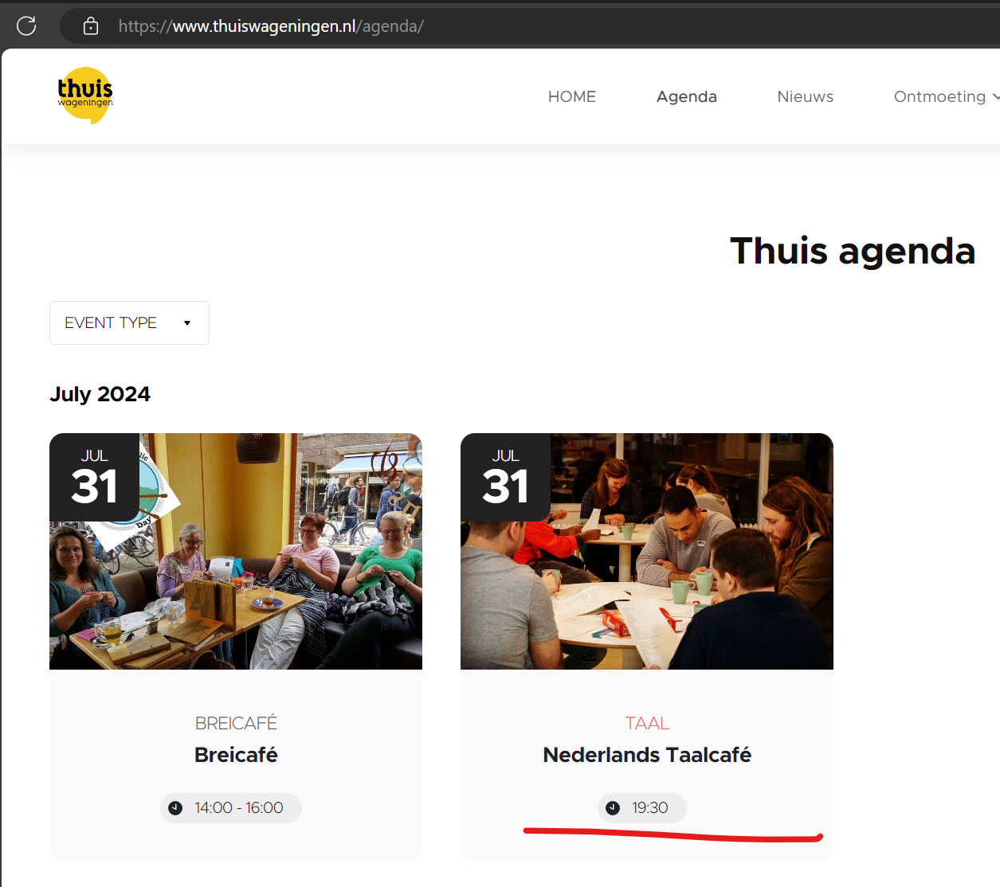 |
| :----------------------------------------------------------: |
|                   Thuis Wageningen荷兰语吧                   |

这里再推荐几个我最喜欢的荷兰语学习资源：

1. [LingQ](https://www.lingq.com/)，间隔重复工具，可以导入各种类型的语料，然后进行间隔重复学习。
2. [Een Beetje Nederlands Podcast](https://www.eenbeetjenederlands.nl/)，荷兰语学习podcast，内容为介绍荷兰各方面，非常值得学习。B1水平，但对于英语好的人来讲可以0基础开始使用。
3. [NOS Jeugdjournaal](https://jeugdjournaal.nl/)，专门为10-19岁青少年定制的广播频道，内容为荷兰时事新闻，水平大概在B2，有的语速比较快，需要有一定基础。

## 社交:ok:

保持社交是避免心理问题的方法之一。在中国学生圈子里，除了每栋学生公寓的微信群外，还有各种吃饭、拼单、游玩的群。从共同爱好来看，瓦村有各种爱好组织，体育、烹饪、游戏、舞蹈以及农学院校特色的[种田](https://creativegardenwageningen.wordpress.com/)都能轻松找到。在日常生活中，同项目的学生、老师是重要的社交对象，课间的时候建议不要玩手机，直接“How are you?”起手问问同学的日常琐事，熟络起来之后就可以组织各种活动进一步从同学发展为朋友关系了，关系起步阶段最合适的活动是potluck、bbq、party等人人能轻松参与的活动，后续可以安排一起出游，体育项目。一般来讲各个项目的学生也会组织类似的活动，不熟悉组织活动的同学可以从中学习。一般来讲荷兰人朋友比较难交到，因为荷兰太小，不少荷兰人会选择周末回家找童年好友一起玩，但笔者还是建议想留在荷兰的同学多认识荷兰人，这样以后在荷兰混容易找到人帮忙。

### 开聊技巧

对于i人而言，主动开启聊天犹如上刑场，但其实聊天也是一种可以学习的技能。对于任何场合，可以用如下经典问候语开场：

1. How are you?
2. How's going？

一般来讲，只要你开了头，善于聊天的欧洲人就会打开他们的话匣子，最差的情况下，他们也会回“good, and you?”，这时候你可以用一些夸张，但能一定能激起人共鸣的回复，比如

1. Fine, but the rain is killing me. 
2. Good, and the weather is too good to study.
3. All good, except suffering from the insane workload of this course.

如果话匣子还没打开，可以继续用一些不会错的万能话题：

1. How do you feel about the weather in the Netherlands?
2. How do you feel about the course/event so far?
3. How do you feel about the university?
4. What is your marjor? What was the motivation for you to choose this program?
5. Do you have any thoughts on your thesis/internship?
6. Do you play any sport?
7. How long have you been in Wageningen?
8. ...

总而言之，问对方关于某件日常事物的想法是最好的选择，这样的开放式问题最容易让人打开话匣子，而且因为人们都喜欢谈论自己，喜欢被倾听。问对方怎么看远比你自己输出观点要好，另外，让对方输出也可以降低自己因为不熟悉对方背景而不小心冒犯到ta的概率。

如果你发现对方挺有意思，对方也没有不耐烦的迹象，可以通过追问、联想的方式继续聊天并深入。比如对方说喜欢足球，你可以问ta踢足球多久了，怎么学的足球，一般什么时候踢足球，如果自己要学足球ta有什么建议...

总而言之，掌握了这一套万能流程后基本上就不怕第一次见面聊天没话说了。

## 学习:ok:

### 重要性:ok:

对于准备回国就业的同学，在WUR的成绩不重要，因为国内校招初筛主要看本科学校，面试又完全取决于个人能力。

对于要在欧洲读博的同学，成绩非常重要，因为荷兰授课硕的特性导致绝大多数人都不会像国内硕士一样有论文发表，在没有发表和强推荐信的情况下，成绩是申博时最重要的筹码。WUR许多老师明确表示会优先选择拿了cum laude（均分8+，thesis 9+）的学生作为博士生。

对于准备留荷兰工作的同学，笔者也建议朝着拿一个好成绩的方向走。就我个人的观察而言，好成绩和毕业后好的发展是显著正相关的，**我从未见过在荷兰拿了cum laude毕业的人毕业后愁找不到工作**，但成绩平平找不到工作的人却有一大把。虽然大多数企业不会直接用成绩来筛人，但一些企业的优质项目，比如下图的ASML奖学金对成绩有要求。此外，取得好成绩的过程中，人往往会收获优质项目经历、论文发表等成果，而这些成果在任何地方都会得到认可。

总而言之，对于准备在欧洲发展的同学，千万不要用“在欧洲成绩不重要”麻痹自己，如果你无法保证毕业时有论文发表、优质项目等能让你脱颖而出的经历，以好成绩为目标是最稳妥的选择。

| 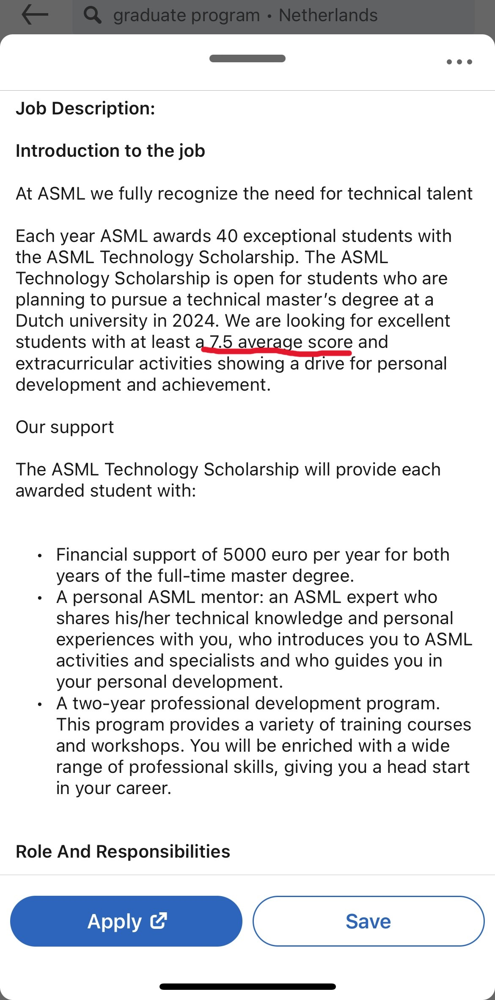 |
| :----------------------------------------------------------: |
|                       ASML Scholarship                       |

### 难度:ok:

不同项目不同课程的难度差异很大，但从统计上来讲，中国学生在WUR拿8+的分数并不算太难。WUR有各专业的[Grading Table](https://www.wur.nl/en/education-programmes/study-abroad-and-exchange-students/outgoing-from-wageningen-university/grading-table.htm)，可以看到近一年各项目授予分数的分布，我个人在简单浏览后发现各项目8分及以上分数的比例为30-50%不等。需要注意的是这个Grading Table并不是所有人的均分，而是特定分数的被授予的数量。

根据2023-2024年的grading table，假设所有课程学分相同，我计算出MBE和MBF专业加权均分别为7.435，7.6，分别作为较难项目和较为简单项目的代表。总之，你可以理解为WUR硕士的加权均分为7.5左右。

就我个人体验来讲，WUR的难度远低于哈工大深圳，我在WUR每周课内学习专注时间20-30h，偶尔忙的时候40h，并且保持了考前不高强度复习的坏习惯，一年下来均分8.125，在WUR应该是前20%左右的水平。

那为什么在网络上会听到欧洲衡水的说法呢？第一，中国学生普遍英语较差，极少数人在入学前能达到无语言障碍上课的水平，所以入学后自然痛苦。第二，吃喝玩乐是部分中国学生的生活中心，而非学习。第三，要考虑到中国学生经典的“谦虚”或者说“凡尔赛”文化。其实造成这一现象的原因还有很多，但总体而言，WUR硕士难度不如国内985。

| 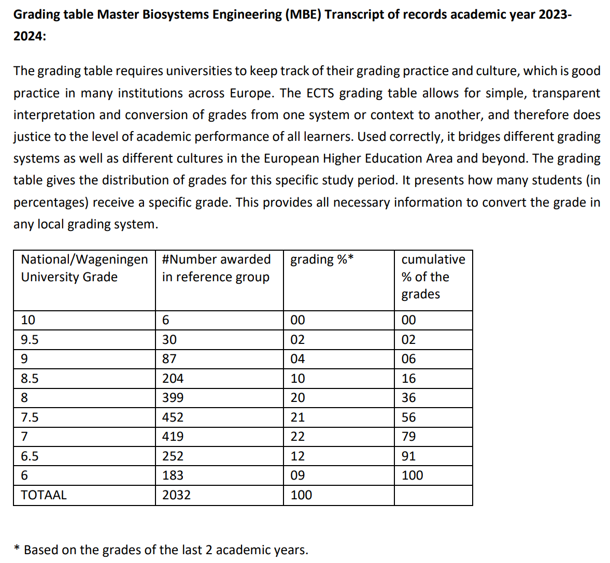 |
| :----------------------------------------------------------: |
|        Gtading Table for MBE, academic year 2023-2024        |

|  |
| :----------------------------------------------------------: |
|        Grading Table for MBE, academic year 2023-2024        |

### 选课技巧:ok:

WUR所有课程往年的学生教评都可以在[Study handbook](https://studyhandbook.wur.nl/modules/FTE35306)上查看，尽量避开差评多的课程。如果你想要拿高分，可以选择学生反映给分高的课程。

### 组队技巧:ok:

折磨人的队友是瓦村学习中一大困扰。WUR大部分课程考试分数占50%，课程报告分数占50%，队友质量非常影响报告的分数。对于可自由组队的课程，可以提前找好靠谱的朋友，或者在开课后高强度社交，通过了解专业、志向、分数等方式找到靠谱的人并组队。

如果你想在不想太多的情况下找到好队友，最简单的办法就是第一节课坐前排，然后跟同样坐前排的同学聊天。前排学生比较努力好学这一点在全世界都一样。

### 演讲技巧:ok:

虽然WUR是[4tu.nl](https://www.4tu.nl/en/)的一员，但终究不是一所以工程为主的学校，并且WUR强调interdisciplinary，所以你的听众往往会有许多非专业人士。这种情况下，拿高分的演讲往往是让思路清晰，语言易懂，让所有人理解项目大概思路和要点的演讲，而非做出深度探讨、展示工作量之大和项目难度之大的演讲。笔者在这一点上吃了很多次亏，直到硕士第一年结束才恍然大悟，学弟学妹们一定要注意这点。

### 备考技巧:ok:

一定要学会抓大放小，[帕累托法则](https://zh.wikipedia.org/wiki/帕累托法则)同样适用于学习——20%的知识能帮你拿到80%的分数。通过查看课程的learning goal以及与老师聊天等方式可以得知重点。

### 向上管理:ok:

一个非常离谱但又真实的情况是，对于很多课程，WUR的老师在阅卷时能够看到学生的名字...所以给老师留下好印象就非常重要。通常来讲，只要你上课坐前排，多和老师互动，你在老师心中的印象分就会比较高。除了最后课程能拿到高分外，良好的印象也能帮你更轻松地获得老师手头的资源，比如TA，intern，PhD，EngD机会。

### 学习资源:ok:

1. WUR公共的房间可以通过[timeedit.net](https://cloud.timeedit.net/wur_nl/web/student/)预定，不公共的房间可以让有权限的老师帮忙定。
2. 学校[图书馆](https://www.wur.nl/en/library.htm?utm_source=verkorte_url&utm_medium=redirect)除了借阅书籍外，还提供各种学术相关培训。
3. WUR绝大多数房间的桌椅都符合人体工学设计，记得调整到健康且舒服的位置哦。
4. 用学校邮箱可以免费获取很多软件资源，比如[GitHub Student Developer Pack](https://education.github.com/pack/offers)。购买各种服务前一定首先试试能否用学生优惠白嫖。
5. 关注各建筑墙上的海报，有海量培训和讲座等你发现。

### 协作工具

1. Deepnote
2. Overleaf

## 兼职:ok:

留学生在荷兰兼职可以被雇佣或者自由职业（Freelance），雇佣情况下选择每周不超过[16小时](https://ind.nl/en/residence-permits/work/employing-a-foreign-national#:~:text=A foreign student is only,in June%2C July and August.)，或者6，7，8月全职。并且需要申请[TWV](https://www.uwv.nl/en/employers/work-permits)许可，通过时间一周到两个月不等，建议按照一个月预估。打工期间需要买[Dutch Basic health insurance](https://www.hetcak.nl/en/uninsured/getting-dutch-health-insurance/)，价格基本在120-150欧左右，学生可以申请[荷兰政府的医保补贴](https://www.government.nl/topics/health-insurance/applying-for-healthcare-benefit)，基本能覆盖保险全部金额。做Freelance的情况下，[工作时间没有限制](https://www.kvk.nl/en/starting/freelancing-as-a-student/)。学生做的freelance通常在医疗保健、餐饮或物流行业，这些工作往往可以在一些app上找到，并且时间非常灵活，常见的找freelance工作的平台有[YoungOnes](https://youngones.com/nl/)，[Temper](https://go.temper.works/en-nl)。需要注意的是，在荷兰做Freelance需要申请一个[KVK号](https://www.kvk.nl/en/starting/kvk-number-all-you-need-to-know/)用来缴税。

最常见的学生兼职有：

1. 送外卖
2. 餐厅打工
3. 超市码货
4. TA(Teaching Assistant)
5. ...

TA是所有兼职中最轻松的，因为大多数学生提问不积极...对于需要TA的课，当TA最常见的方式是第一年上这门课多跟老师互动，取得好成绩，然后老师就会邀请你当次年的TA。第二种方法是直接问自己比较熟的老师，让他收你做TA，或者推荐。其他兼职的申请主要靠朋友推荐、进店问，和官网申请。

建议补充阅读Erasmus University的兼职指导：

[Work while you study | Erasmus University Rotterdam (eur.nl)](https://www.eur.nl/en/education/practical-matters/orientation-arrival/work-while-you-study)

## 就业

WUR标准的硕士结构为首年9月-次年6月上60ECT的课，次年7-8月为暑假，次年9月到后年2月完成Thesis，后年2月到6月做Intern然后拿学位毕业。

### Thesis:ok:

Thesis对于想要读博的同学至关重要，因为这会是你整个硕士期间对于科研能力最有效的一次考核，也是最有机会发论文的一个机会。在Thesis中拿到9分是在WUR拿[cum laude](https://www.wur.nl/en/contact-wageningen-university-research/frequently-asked-questions.htm)的必要条件，也是后续申博期间的重要加分项。至于发论文，6个月的时间看似太短，但其实只要导师和项目找对，用Thesis的成果发论文在WUR是完全可行的。当然，论文的发表会在Thesis的那6个月后。[FTE组](https://www.wur.nl/en/research-results/chair-groups/plant-sciences/agricultural-biosystems-engineering.htm)一位管Thesis的老师写道“Past few years, experience has learnt that our MSc thesis projects are of such high quality that some 50% could be presented during conference on agricultural engineering, precision agriculture, horticulture and livestock farming”. 下面是FTE组一些Thesis成果论文发表的例子（引自FTE组BrightSpace页面）：

1. Henten,. E.J. van, Kruize, J.W., 2008. Analysis of a mobile growing system for roses: a simulation study. AgEng2008 – International Conference on Agricultural Engineering, 23 – 25 June 2008, Hersonissos – Crete, Greece, Paper OP-1670, pp. 7
2. Henten, E.J. van, Stanghellini, C., Bontsema, J., Gallardo, T., Ooster, A. Van ‘t, 2010. Estimating greenhouse ventilation, crop transpiration and roof condensation using an unknown-input observer. Proceedings of the International Conference on Agricultural Engineering – AgEng2010, September 6-8 2010, Clermont-Ferrand, France, Paper REF456, pp. 10.
3. Henten, E.J. van, Marx, G.E.H., Hofstee, J.W., Hemming, J., Sarlikioti, V., 2012. Measuring Leaf Motion of Tomato by Machine Vision. Acta Horticulturae, 952: 915-922.
4. Slager, A.A.; Sapounas, A.; Henten, E.J. van; Hemming, S., 2012.
   Feasibility study on combined production of algae and tomatoes in a Dutch greenhouse.
   Acta Horticulturae, 956: 569 - 576.

本人所在的[INF组](https://www.wur.nl/en/research-results/chair-groups/social-sciences/information-technology-group.htm)近两年也有Thesis成果发表的案例，论文的名字我忘记记录了，但会议和期刊都有。

如果想发论文，导师和项目怎么找呢？

导师方面，建议找近期发文量/被引指数上升的AP(Assistant Professor)，他们往往正直学术事业高速发展期，发表意愿强，有拿捏风口的能力。

项目方面，做有funding支持的项目，而非你自己或者导师突发奇想出来的题目。有funding支持的项目往往有deliverable（可交付成果）要求，而在大多数无法落地的研究项目中，论文就是最重要的deliverable，所以参与这样的项目最有可能发表。

### 实习:ok:

WUR的两年硕士项目都有24ECT，也就是四个月的[internship](https://www.wur.nl/en/research-results/chair-groups/social-sciences/operations-research-and-logistics/education/master-internship.htm)，这个intern时间可以延长至6个月甚至更多。Intern可以在企业做，也可以用学校里做的[Research Practice](https://www.wur.nl/en/research-results/chair-groups/environmental-sciences/forest-ecology-and-forest-management-group/education/msc-research-practice.htm)替代，但下文仅讨论去企业做Intern的情况。对于秋季入学的同学，往往会在毕业年2月-开始实习，在6月或者8月结束实习。一般建议提前半年开始找实习，也就是硕士第二年的9月，这也是许多大公司统一放出次年实习时间点。荷兰实习非常好找，除了部分待遇优厚、竞争激烈的互联网、量化大厂外，其他公司只要你的教育背景对口，英语ok，intern基本没有可能被拒。背后的原因是荷兰做intern的学生对于企业而言是优质廉价劳动力。法律上做intern的学生是在企业接受教育，所以企业可以不支付任何薪酬。虽然大多数企业会给一定的钱作为补偿，但农学、食品领域大部分企业只能给到300欧每月，只有Unilever等大厂能给到600欧。由于大多数企业实习时间长度为6个月，所以前述6月做完实习毕业就会变成8月毕业，这意味着你在WUR读书期间不能有任何差错，否则就要延毕，因此我建议不想延毕的同学尽早开始Thesis和Intern。

实习的企业和岗位至关重要，因为很多WUR人毕业后会留在实习企业工作。选择企业时不要只看名气大小，有的大公司业绩不好，连续多年降本增效，加入这样的大企业不如做优质业务蓬勃发展的中小企业。选择岗位时，要学会通过看jd和找人打听的方式判断intern岗位是否是短期廉价劳动力。举例说明，一个在农业企业非常常见的情况是，老板有一个拍脑袋想出来的炫酷想法，不确定是否有商业前景，也舍不得花钱请人全职做R&D，于是就从WUR招每个月成本不过几百欧的实习生来做。这样的廉价劳动力intern岗位做完之后留用的概率非常小。相比之下，一些看似没有那么高大上，不那么academic的岗位，反倒容易被企业发return offer，因为这样的实习生熟悉企业业务，入职后不需要过多培训就能上手干活，是经济下行期企业最喜欢的类型。这类非academic岗位与WUR对 internship的学术性的要求有一定矛盾，但荷兰凡事皆可谈，提前准备与academic advisor等人谈判就好。

### 工作

2025.8后更新

### 读博

2025.8后更新

### 心态

## 文化:ok:

拿捏荷兰的工作生活文化能让我们地生活更加美好。

### 主动

荷兰干啥都看重motivation，而主动出击就是展现motivation最重要的方法之一。以申请TA为例，同样是提交了申请，不断询问招聘进度，与老师沟通的同学更容易拿到岗位。找科研岗位、企业工作道理类似，通过主动了解、主动询问、主动探讨可能性等方式展现自己的人更容易获得资源。

### 灵活

荷兰只要不是违法的事情，都有一定的操作空间。举一个最常见的例子，预约，假设你预约在10：00-10：15在乌特勒支取居留卡，实际上并不需要你准点到达，当天都能取，许多位置不紧张的预约也是类似的道理，因为工作人员完全没有必要检查你的预约时间。再举一个例子，WUR部分办公楼仅对拥有权限的人开放，原则上讲学生只有在Thesis期间才能获得权限，但你完全可以让导师帮你找个理由把权限开到你毕业。再说一个找实习的例子，你有一家心仪的企业，但官网上没有实习岗位，这时你可以通过与相关人员沟通的方式定制一个实习岗位。总而言之，谈，都可以谈！

### 关系

有人的地方就有社会关系。荷兰社会同样看关系，甚至于比中国社会更看关系。荷兰人找兼职、全职工作、找房都会看看能不能用自己的关系网络搞定，所以一定不要抱着逃避国内讲关系的心态来荷兰，要拓展并管理好自己的关系网络。

## 小知识

1. [Unilever](https://maps.app.goo.gl/o5B4MMH9Kxq4VQdc9)，[Plus Ultra2](https://maps.app.goo.gl/1QzK36ek8FASDrdE8)，和Helix可以白嫖咖啡。
2. 就Cafe而言，NK对面[Onder de Linden](https://maps.app.goo.gl/zHwNknfEbBYRCQVJ6)质量远高于市中心[De Kater](https://maps.app.goo.gl/56jpuRMuM7Bi464X7)。
3. 瓦村密室逃脱很好玩，[Escape Room Wageningen](https://maps.app.goo.gl/M4uZDYLtYf6VuQtv9)，注意学生优惠的时间。
4. 隔壁城市Veenendaal的保龄球不错，[Olround Bowling Veenendaal](https://maps.app.goo.gl/7jvGJAdz1MtLiS5V6)。
5. Helix有WUR体验最好的工位。
6. 在AH买不到排骨，但是Jumbo可以。

### myWUR Today

[myWURtoday](https://www.wur.nl/en/education-programmes/current-students/mywurtoday.htm)是学校的信息平台，能帮助学生快速查看校内各种信息，包括但不限于课程时间表，校方通知，校园新闻，各类活动，你可以选择性地订阅各种信息，非常方便。

我个人最常用的功能是日历，显示你的课程以及学校邮箱里的日历项目。

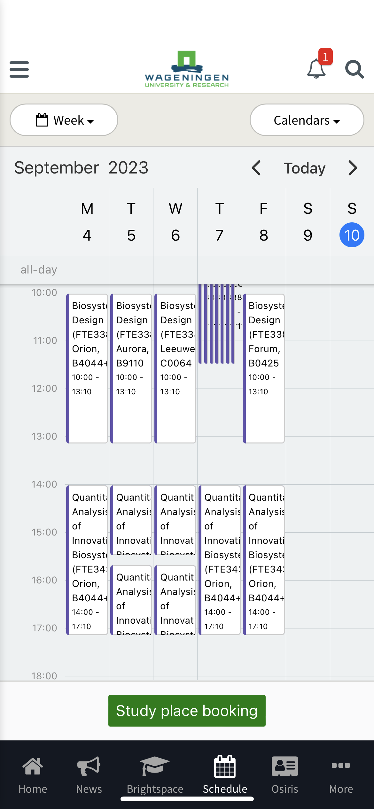

其次是新闻，主要用来看学校的各种通知、校园里的各种活动。下图显示了两个参与实验拿礼品卡、一个校园荷兰语、一个校内工作机会。

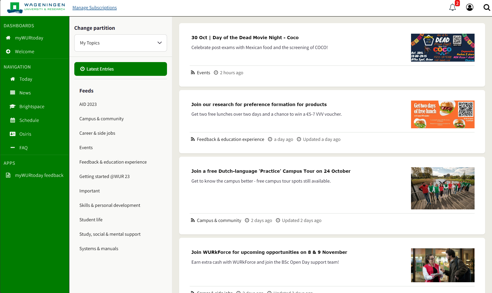
