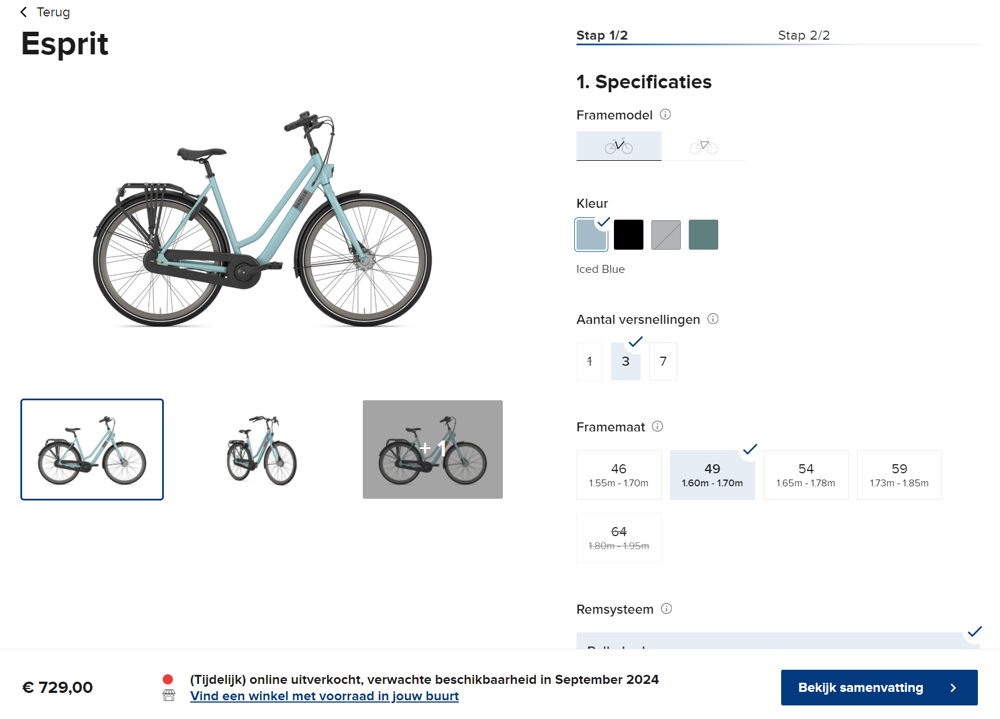

# wur_life_lore

> 本文从一个WUR硕士项目新生的视角分享瓦村生活知识，因此主要适用于WUR硕士新生参考。

标有:ok:的章节意味写作完毕。

## 新生租房:ok:

### 新生租房简介

瓦村学生房源主要由与学校合作的[Idealis](https://www.idealis.nl/en/)提供，并通过[room.nl](https://www.room.nl/)平台进行选房。由于room.nl在分房时按照账号注册时间先后和priority排序，所以新生需要尽早在room上注册。7月左右新生会收到idealis发来的priority邮件，7.15 priority生效后选到房的概率较大。总体来讲瓦村租房压力不大，4月注册room.nl也能有一定的房间选择空间，如果和我一样前一年10月开始申请时就注册了，那么有优先权的房子基本随便选。

### 选房

因为优先权仅分配给部分房源，瓦村硕士新生基本上只能排到Nieuwe Kanaal（NK），Bornsesteeg（B楼），Dijkgraaf （D楼），Hoevenstein（H楼），Asserpark（A楼），Marijkeweg（M楼），Haarweg（哈外）的房间，我个人的建议是优先选NK，理由如下。

1. Self-Contain房型
   1. 独立卫浴，厨房，隐私性好
   2. 不用开室友盲盒

2. 房间均为18平，大小不错。

3. 房补之后月租在320欧左右，和share房型其实差不多，有时甚至更加便宜。（有的人可能会贵100欧，取决于此前的能源费用，但能源费用后续会多退少补）

4. furnitured，自带一张床，一套桌椅，一个衣柜，一个冰箱。

5. 有空调，而其他楼没有。

6. 浴室有空气控制系统，可以根据湿度和二氧化碳浓度动态排气。

7. 有智能电表，可以查看每天各时段功率，每天和每月耗电量。

8. 墙壁和窗户隔音效果极好，只有门隔音较差。

9. 楼层低，不会被A、B、H、D楼的垃圾老电梯折磨。

10. 门口就是公交站，公交非常方便。

11. 骑车去市中心和学校均在8min左右（我个人速度）。

12. 中国人很多，中餐聚会方便。

13. 建筑中没有石棉这种致癌物，荷兰在1993年之后才禁止石棉的使用，而瓦村老公寓都在此之前建成。“所有形式的石棉**对人体均有致癌性**。 接触石棉，包括温石棉，会导致肺癌、喉癌和卵巢癌，还会导致间皮瘤”——[WHO](https://www.who.int/zh/news-room/fact-sheets/detail/asbestos-elimination-of-asbestos-related-diseases#:~:text=所有形式的石棉对,工作场所接触到石棉。)。前段时间M楼的朋友收到了M楼检测石棉的邮件，说明瓦村的老公寓有一定石棉风险.

    

总而言之**选新不选旧**，**选self不选share**。新房设施先进，东西不容易坏；self保障隐私。

### NK房间选择

NK是一个临时集装箱房，但如前文所述设施非常先进，并且有长满青草地的内庭，南北各有一条河，环境优美。

NK的详细建筑介绍可以看[这里planviewer.nl](https://www.planviewer.nl/imro/files/NL.IMRO.0289.10Nieuwekanaal1-PJB2/t_NL.IMRO.0289.10Nieuwekanaal1-PJB2.pdf)，这里简要介绍**我**对NK的选房推荐。NK各楼层房号分布基本一致，这里以floor1为例。注意，floor1相当于国内二楼，因为荷兰的楼层从0而非1开始。使用排除法得出最佳房型：

1. （必须）排除**common room和洗衣房附近房间**，即图中正下方红圈的房间。commom room主要用来开party，party人半夜玩high了非常吵。
2. （必须）排除**门面向内庭的房间**，很多人party人半夜在内庭high，而门是NK隔音最差的部分。
3. （必须）排除**0楼所有房间**，隐私性非常差，不把窗帘拉上的话房间在路人眼里一览无余，而且太低看不到风景。
4. （必须）排除**东侧窗户靠内的房间**，即图中正上方红圈的房间，隐私性差，没有风景。
5. （可选）排除不被其他房间包住的房间，比如建筑四角的房间，保暖性差。
6. （可选）排除顶楼3楼的房间，保暖性差。
7. （可选）排除西面房间，西晒非常折磨。
8. （可选）排除南面房间，荷兰纬度高，南面太阳直射眼睛。
9. （可选）排除东面房间，窗户面朝交通主干道。

经过以上排除后，我最推荐的房间是**1楼和2楼北面，门不直对内庭的，且不在建筑四角的房间**，即**绿圈**内的房间。

### 技术细节

Idealis的房间在签合同时需要用手机接受验证码，但国内手机卡收不到验证码，这时可以找在荷兰的朋友用荷兰手机号帮忙收验证码。

Idealis的工作时间非常短，这非常不利于新生取钥匙。第一种解决方案时写邮件给idealis或者对应楼的housing manager，让他们把钥匙放在B楼0层的钥匙箱里，到达瓦村后用钥匙箱对应密码取出钥匙即可，第二种方案是托朋友取，这种情况需要联系idealis，并说明身份验证方式。

## 房补申请:ok:

住idealis studio的新生都可以申请房补，申请流程参见我的知乎回答，[荷兰房补申请流程 - 知乎 (zhihu.com)](https://zhuanlan.zhihu.com/p/655821518)。

## 衣着:ok:

每个人的抗寒耐热能力不同，这里把我这个湖南人在瓦村的穿搭习惯列出以供参考：

| 月份    | 室内             | 室外                    | 备注                                                         |
| ------- | ---------------- | ----------------------- | ------------------------------------------------------------ |
| 11-3    | 短袖t恤+长袖衬衫 | 短袖t恤+长袖衬衫+羽绒   | 由于能源危机，环保因素等原因，WUR教学楼室内大概20度左右，穿短袖会比较冷 |
| 4-5, 10 | 短袖t恤+长袖衬衫 | 短袖t恤+长袖衬衫+冲锋衣 | 这里的穿着均为平均值，不代表少数极端气温                     |
| 6-9     | 短袖t恤          | 短袖t恤                 |                                                              |

关于荷兰天气的详细评价，参考我的知乎回答， [荷兰天气真的很差吗？ - 知乎 (zhihu.com)](https://zhuanlan.zhihu.com/p/688753296)。

## 自行车:ok:

因为公交车昂贵，覆盖范围小，频次低，自行车是瓦村学生最主要的日常交通工具。

### 买车

我建议去正规车店买高质量的二手车。

首先，为什么二手？由于荷兰产业转移，增值税较高等原因，荷兰新自行车的价格远远高于国内，不错的新车往往要五六百欧才能拿下，而用过三五年内的二手车能在体验极为接近新车的情况下，价格是新车的70%，50%甚至更低。比如笔者目前使用的Gazelle Esprit，新车售价729欧，而我购买车龄不到3年（车架上可见生产年份）仅需450欧，是原价的61%，使用近一年除了1月最冷的几天出现过无法换档的情况外无任何爆胎，掉链子等折磨人的情况。

第二，为什么买高质量？

自行车作为每天都要陪伴我们的伙伴，如果很难骑或者经常损坏会十分令人糟心，所以我非常不建议为了省个一两百欧买伊拉克战损的n手车。破烂n手车虽然几十欧就能拿下，但是后续维修、换车所需的时间和金钱成本完全足够让你在一开始买一辆好车。那么如何判断车的质量呢？从价格上来看，正规车店200欧以上的车都还不错。从车本体而言，链条光滑，漆面无大面积脱落，换挡顺滑，车轴和车体连接不松垮的车质量不会太差。

第三，为什么去正规车店买？

正规车店卖的车根据荷兰消费者保护相关法律，参见：[Consumer Rights in The Netherlands - Amsterdam Mamas (amsterdam-mamas.nl)](https://amsterdam-mamas.nl/articles/consumer-rights-in-the-netherlands/)， 应当提供6个月的质保。一些车店也会提供更长时间的质保，比如我买车的这家店[Van de Wetering tweewielers (vandeweteringfietsen.nl)](https://vandeweteringfietsen.nl/)就对二手车提供12个月质保。

关于车本身的特性，我个人比较看重以下几点：

1. 有链条护罩
2. 至少三档
3. 手刹（脚刹骑不好就容易打滑摔倒）
4. 出厂前后车灯

### 修车

如果你的车是从车店买的并且质保没过期的话，直接让车店修就好啦，否则可以取瓦村学生们组织的免费修车，或者其他修车/单车店。

1. 瓦村学生每周免费修车[WUR_student_bike_repair](https://www.instagram.com/wur_student_bike_repair/)。
2. Jumbo对面的修车老爷爷。
3. 各种单车店。PS：离学校最近的是[这家店](https://maps.app.goo.gl/JG2jzLoVBN2GvGka7)，但我听说过一些不好的体验。

另外，部分idealis学生公寓有修车高手，我的一个荷兰朋友非常热爱修车，可惜他已经从NK搬到了Costerweg。

### 配件

锁

一般来讲，自行车会自带一个这样的环形锁，把轮胎和车身锁住。在瓦村这样相对安全的地方，这个环形锁基本够用。

但如果你是风险厌恶型选手，建议再来一个链锁，把车身和停车架等不可移动的东西锁在一起。

车灯

荷兰法律规定晚上骑车必须打开前后车灯，前灯白色或黄色，尾灯红色，不开灯被抓会罚款大几十欧。

车包

车包是在瓦村买菜遛弯的必备配件，因为自己的背包往往容量不足，而且背着一大堆东西骑车很不舒服。车包选择防水大容量的即可，我个人在瓦村市中心的[Blokker](https://maps.app.goo.gl/Q8q9D3u3e716UcDw6)买的这一款[车包](https://www.blokker.nl/dubbele-fietstas-40l-recycled/3529028.html)，价格比较高但是防水耐造，容量很大，可以一次性装下两人份一周的菜。

### 骑车规则

荷兰交通规则与国内大体类似，主路先行，让右，礼让行人。这里列出几个和国内比较明显的不同。

1. 左右转弯前伸出对应手臂指明转弯方向。
2. 地上的鲨鱼牙代表你必须让行。
3. 夜晚骑行必须开前后灯。

较为详细规则和路牌速览见：[holland2stay.com/blog/dutch-cycling-rules.html](https://holland2stay.com/blog/dutch-cycling-rules.html)

瓦村相关骑行见： [Welcome - Cycling In Wageningen](https://www.cyclinginwageningen.nl/)， 内含瓦村修车点，租车点，停车设施，推荐的观光骑行路线等

官方全面解释见: [Road Traffic Signs and Regulations in the Netherlands | Report | Government.nl](https://www.government.nl/documents/reports/2024/02/09/road-traffic-signs-and-regulations-in-the-netherlands)

特别需要注意的是，实际情况中你会发现很多荷兰人骑车违反交通规则，很多人认为确保安全的情况下没必要循规蹈矩。这种行为留学生是否要效仿？我认为确保人身安全和钱包安全即可。

## 公交、包车:ok:

### 包车

从机场到瓦村23年时的价格是50欧左右每人。我2023年8月落地时约的是村里的[伊朗大叔](https://dilmanlogistics.nl/) Dilman，可以加微信沟通，提前约好在机场停车场见面的时间即可。Dilman人非常热情，在接送的路上会和新生唠嗑，给新生科普瓦村知识，同时也会给新生发Lebara的电话卡，帮新生免去了落地自己找电话卡的步骤。

### 公交

荷兰公交在欧洲范围内算是非常顶级的存在了，公交、火车频率一般在每30、60分钟一趟，准点情况也远好于隔壁德国[DB](https://int.bahn.de/en)。可以直接通过Google Map，Apple Maps查看车辆班次，但荷兰人都更喜欢[9292.nl](https://9292.nl/)。公交的实时位置可以通过[ovzoeker.nl](https://www.ovzoeker.nl/)查看。

荷兰全国通用的乘车方式是刷卡乘车，上下车都要刷，被抓到逃票会罚款几十欧，只上车刷而不下车刷会按最大可能行程扣款或者罚款。Mastervard或者Visa卡（ApplePay上的卡也行）可以直接刷，然后通过[OVpay](https://www.ovpay.nl/en)查看记录，也可以刷[OV卡](https://www.ov-chipkaart.nl/)。我个人比较推荐用OVpay，因为用了ApplePay以后可以只带手机出行，并且OVpay的app会实时显示check-in和check-out的消息，避免了OV卡不知道是否刷卡成功的问题。另外，ApplePay+OVpay也远比OV卡灵敏，刷卡时基本在1s内成功，而OV卡很多时候会出现好几秒甚至更长时间才能刷上的情况。

### OV卡办理

OV卡办理有两种方式，第一种是去官方购买[OV-Chipkaart.nl - OV-Chipkaart.nl](https://www.ov-chipkaart.nl/)，有匿名和实名两种，实名只能本人使用，但是可以用来办理各种交通运营商的服务套餐。OV卡官网办实名卡收取7.5欧制卡费，所以我更推荐第二种方法。第二种是去[NS](https://www.ns.nl/abonnementen/)（荷兰铁路）申请NS Flex的优惠，申请时选择开一张新卡，这样在5个工作日内你就会得到一张带有NS Flex优惠套餐和NS Logo的实名OV卡，无需制卡费。

### NS铁路优惠

[NS](https://www.ns.nl/abonnementen/)运营着荷兰绝大多数的铁路，主要城市均可以通过NS的路线到达，但NS的乘车费用高昂，没有优惠的情况下，从Ede-Wageningen到Amsterdam Centraal需要16.9欧，也就是说周末往返阿姆一趟的火车费就要30多欧。所以大多数瓦村学生会开一张周免卡，周末免费乘坐NS的路线。周免卡的荷兰语叫[Weekend Vrij](https://www.ns.nl/abonnementen/weekend-vrij?gad_source=1&gclid=CjwKCAjwnei0BhB-EiwAA2xuBscghiyakBE_Z7xdIan4z8oRDLQvB88hl6CsgWzNinJG68ZjrdwLhBoCUzkQAvD_BwE)，每个月费用34.95欧，并且可以加9欧升级为周末免费一等座，个人非常推荐加这9欧，因为二等座经常会找不到座位。不想自己开周免卡的同学可以在各种群里收周免卡，但做好被查到非本人使用的心理准备，即使概率很小。

除了周免卡外，NS的其他各种优惠也可以在[NS官网](https://www.ns.nl/abonnementen/)办理。

## 购物

### 超市

AH

AH togo

AH XL

Jumbo 

Spar

Jumbo对面

### 日用杂物

Action

### 厨具

Blokker

### 网购

Ochama

Bol

Amazon

自提点

## 通信:ok:

荷兰无线网络覆盖良好，我的运营商是Lebara，网络基础设施走KPN，我个人只在极少数封闭建筑里经历过4G信号不强的情况。

流量方面，由于荷兰公共场合基本有WiFi覆盖，包括公交车，博物馆等，所以基础流量开销并不大。对于我这个每个月离开瓦村不超过5次，不喜欢刷视频的人而言，一个月大概会用2GB流量。

常见的运营商有：

1. [Lebara](https://www.lebara.nl/nl/sim-only.html?duration=24&internetLimit=15&unlimited=false&gad_source=1&gclid=CjwKCAjwnei0BhB-EiwAA2xuBrYMMEaxNLv4knwhap4s5McZFh0yidxDOxhwHJXSmWOEgnoN9MAyThoCF54QAvD_BwE&gclsrc=aw.ds)，Lebara有老带新开优惠，新人开Sim Only的情况双方各得20欧，这是我的[邀请链接](https://mgmco.nl/gyvubi)，通过这个链接注册并开通Sim Only套餐，同时保证浏览器Cookies打开即可。
2. [KPN](https://www.kpn.com/mobiel-abonnement/sim-only)
3. [Odido](https://www.odido.nl/)
4. [Ziggo | Vodafone](https://www.vodafone.nl/daarom-vodafone/ziggo/alles-in-1?&utm_source=google&utm_medium=cpc&utm_campaign=vf_b2c_acq_performance_ads_search_br_vf-non-cust__ziggo-mobiel___(mixed)_&utm_content=1494927998_63440833851&utm_term=kwd-298111858308&gad_source=1&gclid=CjwKCAjwnei0BhB-EiwAA2xuBpk3uh7oztP124mwBCMKfXY0pA4F1QKw5BgZp4v-eATEkTO_xrsfnRoCRNYQAvD_BwE)

记得选择Sim Only套餐，这样远比Prepaid划算。

## 金融:ok:

### 银行卡

荷兰三大行。ING、ABN、Rabo这荷兰三大银行的银行卡线上申请都需要BSN才能办下来，但线下存在无BSN办下来的可能，并且三家都有免费的学生debit账户。个人比较建议ING和ABN，因为他俩的web和app端都有英语。PS：我办的ABN卡上传居留卡前只能收钱，不能付钱。

Neo Banks。由于BSN、居留卡等身份信息的办理、三大行办卡激活都需要一段时间，从落地到用三大行卡正常支付的时间比较长（1周-2月），所以落地前期使用Neo banks的银行卡能助我们摆脱现金和国内信用卡的不便。
本人使用Revolut和Bunq，这两家不用实体卡就能用Apple Pay（荷兰几乎所有店都支持contactless），所以开户后就能不带银行卡出门啦。Revolut只需要上传护照和Visa就可以光速开户，Bunq要了我的护照、签证和租房合同。由于国内的信用卡无法直接给Revolut和Bunq账户充值，所以可以向可靠的朋友借余额。
至于Neo Banks的安全性，Revolut Bank参与了Lithuanian Deposit Insurance, Bunq B.V.是Dutch Deposit Guarantee Scheme的成员。同时，立陶宛和荷兰作为欧元区国家，都会在2024年全面加入European Deposit Insurance Scheme。上述三个Insurance均提供100k欧的insurance coverage。总之，个人认为Revolut和Bunq的安全性尚可。
PS: Neo banks也受到监管，注册账户一段时间后（比如90天）需要上传BSN等身份信息。

### 理财

常见的理财平台有：

1. Trading212，Trading212也有老带新优惠，双方各得价值100欧以内股票。我的邀请链接暂时过期，就不放在这里了。
2. [DEGIRO](https://www.degiro.nl/?utm_source=google&utm_medium=cpc&utm_campaign=BrandExact&utm_content=145448568-18791649048&utm_term=e&gad_source=1&gclid=CjwKCAjwnei0BhB-EiwAA2xuBuNbsnDkn_V5gZpsdmZhpWIue9jRiJ7ib00ZSdol5WM9nvApgl0QZhoC-5AQAvD_BwE)
3. [Interactive Brokers](https://www.interactivebrokers.ie/en/whyib/overview.php?gclid=CjwKCAjwnei0BhB-EiwAA2xuBgtL9BLCB-3Of-xV-jYar9oBd0bEwNjyg1V_4E2CxQ21Xuqx6MTOlxoCrO8QAvD_BwE)

## 医疗

### 家庭医生

荷兰家庭医生（GP）的职责是进行分级诊疗，

WUR校园里有一家专门接受学生患者的诊所叫[MC (student-mc.nl)](https://www.student-mc.nl/en/register/)

关于荷兰医疗系统的相信介绍，见

[Dutch healthcare | Thuisarts.nl](https://www.thuisarts.nl/dutch-healthcare)

### 急诊

荷兰急诊直接打电话112，在瓦村打急诊基本会被送到[Ziekenhuis Gelderse Vallei](https://www.geldersevallei.nl/)接受治疗。

### 牙医

荷兰看牙需要用BSN在牙医诊所注册并预约就诊，一定要选个好诊所，因为有的诊所排队时间很长，我的一个倒霉蛋荷兰同学在瓦村某诊所要排队两个月才能做一次regular check，另外荷兰牙医的水平平均也不如国内三甲和好私立诊所医生水平，毕竟国内病例更多，医生经验更加丰富。

我绑定的牙医诊所是这家[PTIW - Praktijk voor tandheelkunde & implantologie](https://www.ptiw.nl/)，距离NK骑车两三分钟，环境精致，[HANNA VERHOEFF](https://www.ptiw.nl/)医生态度和技术都挺好，并且我2024年2月有两次就诊都在预约后几天内。

可以在[Tandarts.nl](https://www.tandarts.nl/)或者[tandartsregister.nl](https://tandartsregister.nl/tandarts/wageningen/)上找到其他牙医诊所，然后打还在收治新病人的诊所的电话注册。

### 药店

荷兰语的药店叫Apotheek，非处方药可以随便买，向店员描述症状即可。

NK南面穿过运河就是一家[药店](https://maps.app.goo.gl/HWMpPnKDphF2iZAs6)，其他药店在Google Map上搜索Apotheek就能找到。

### 报销

WUR的中国学生大部分用的保险是Aon，Aon的覆盖范围还不错，报销流程也简单，只是处理报销的时间可能会比较长，一两个月是很正常的时间。

需要注意的是，关于牙科，Aon保险报销紧急项目（紧急如何定义有aruge空间），洗牙等护理项目不能报销。

## 运动

### SCB

## 语言

### 英语

### 荷兰语

ThuisWageningen

Into Language

## 社交

## 学习

主动

## 兼职

### TA (Teaching Asisstant)

主动找老师询问职位即可

通常老师会在

### 杂工

送外卖

1. [Thuisbezorg](https://www.thuisbezorgd.nl/bezorger?utm_source=mainsite&utm_medium=Referral&utm_campaign=RC_M_WS_NLD_NL_[SCOOB]_[AWRN]_[OWMD]_[Nederlands])
2. 

餐厅服务员

TWV许可

下签时间一周到两个月不等，建议按照一个月预估。

需要将保险换成

